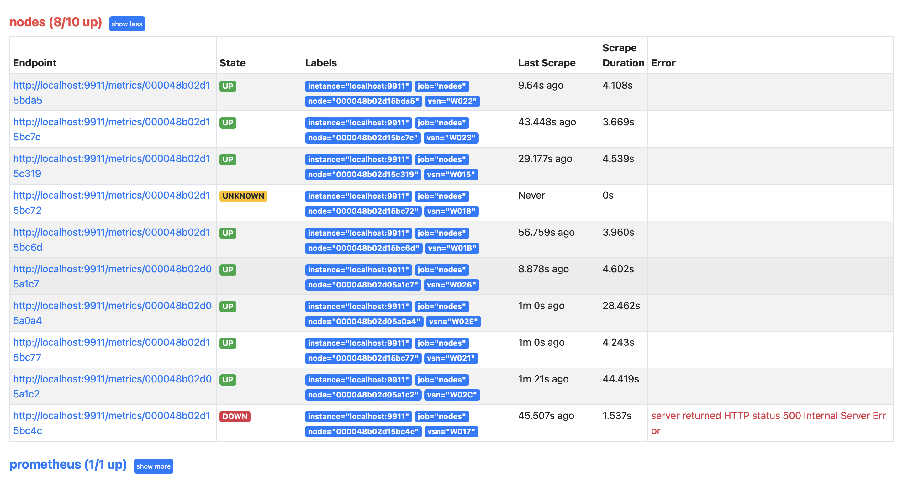
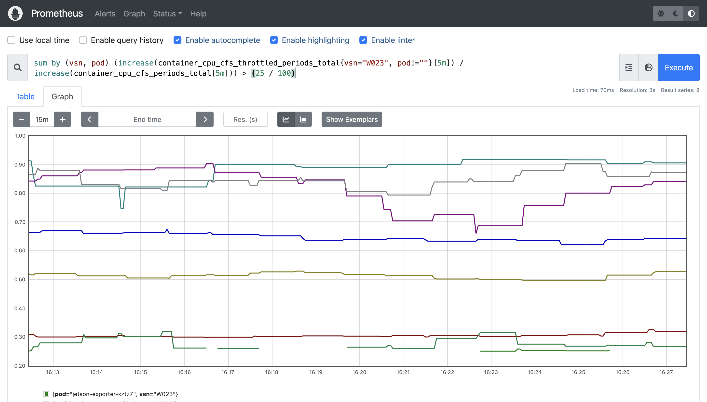

# Prometheus cadvisor proxy (for nodes)

This is a debugging tool used to expose cadvisor metrics on a node via an ssh+http proxy.

_NOTE(sean) Since the intended use is collect the **large** number of cadvisor metrics at a fast-ish interval (at least 1/min), I'm not sure if we want this to be used for steady state monitoring. I view it more as a tool for detailed data analysis and debugging._

## Usage

1. Make sure you have downloaded Prometheus and extracted it to `prometheus-x.y.z`.
2. Go to the `prometheus-tools` directory.
3. Generate a `targets.json` by running:
```sh
python3 gen-targets.py > targets.json
```
4. Copy `prometheus.yml` and `targets.json` into your Prometheus config. (If you are familiar with Prometheus, you can merge `prometheus.yml` with your existing config, otherwise it will work on its own.)
5. Run `go build`.
6. Run `./cadvisor-proxy`.
7. Run Prometheus!

## Examples / Screenshots

As you add targets to your `targets.json` file, you should see them appear in the Prometheus Targets menu:



Here's an example of using cadvisor metrics to look at throttling.

